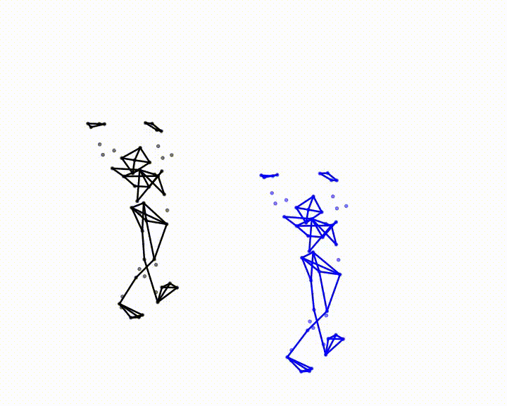
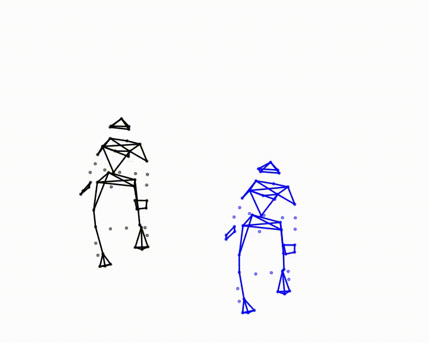
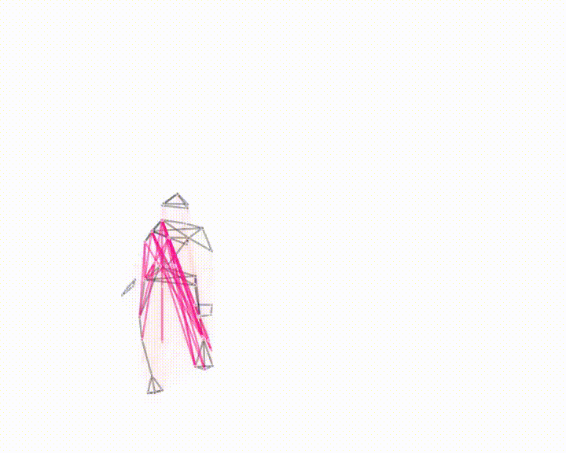
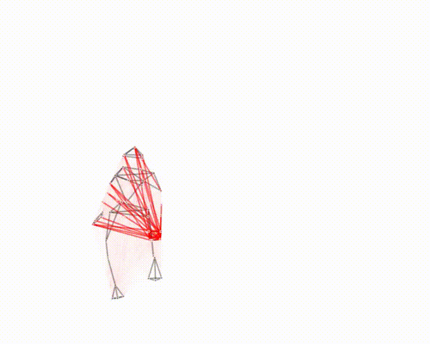
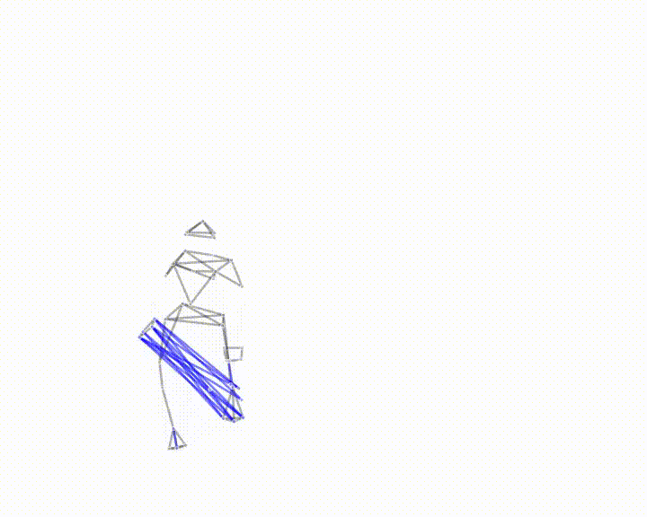
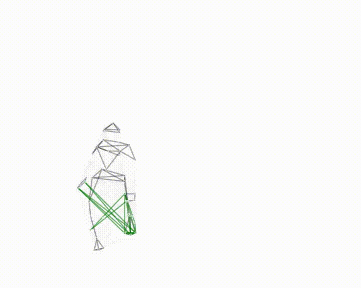

# Choreo-Graph: Learning graph representations of the dancing body
Mariel Pettee, Santiago Miret, Somdeb Majumdar, Marcel Nassar 

This is a codebase for applying GNNs to choreography. Our model, based on Neural Relational Inference (https://arxiv.org/abs/1802.04687; https://github.com/ethanfetaya/NRI), is implemented in Pytorch Geometric. The model sorts the fully-connected directed edges of the input data into discrete learned categories of edge types based on similiarites in their interactions and uses this latent graph representation to predict the future dynamics of the system. 

Dancers may find this work useful to their practice because of the model's ability to identify a small number of edge connections within the body that are important for predicting future dynamics. By isolating the top (or bottom) edges in each category, ranked by normalized log-probability, dancers can gain new insight into their most and least important cross-body connections. By comparing edges between categories, they can also learn some of the various interation dynamics that characterize their motion.

## Dependencies
- torch == 1.4.0
- torch-geometric == 1.6.1
- numpy
- tqdm
- jupyter
- matplotlib
- ffmpeg (recommended for making animations)

## Usage
Example training command to test your setup:

```bash
python train.py --name="test" --epochs=3 --batch_size=1 --batch_limit=1 --node_embedding_dim=36 --seq_len=10 --predicted_timesteps=2
```

Calling the training script automatically loads the raw data contained in the numpy arrays saved in the `data` folder and converts it into graph structures for training. A new folder with the name you gave it ("test", in this case) will be created under the `logs` folder with dataloader objects (`dataloader_*.pth`) saved alongside the log file itself (`log.txt`) and your script's arguments (`args.pkl`).

## Animations 
##### Predictions on a single test batch:


##### Predictions on a test set of 200 timesteps:


##### Edge type #0 (non-edge):


##### Edge type #1:


##### Edge type #2:


##### Edge type #3:

